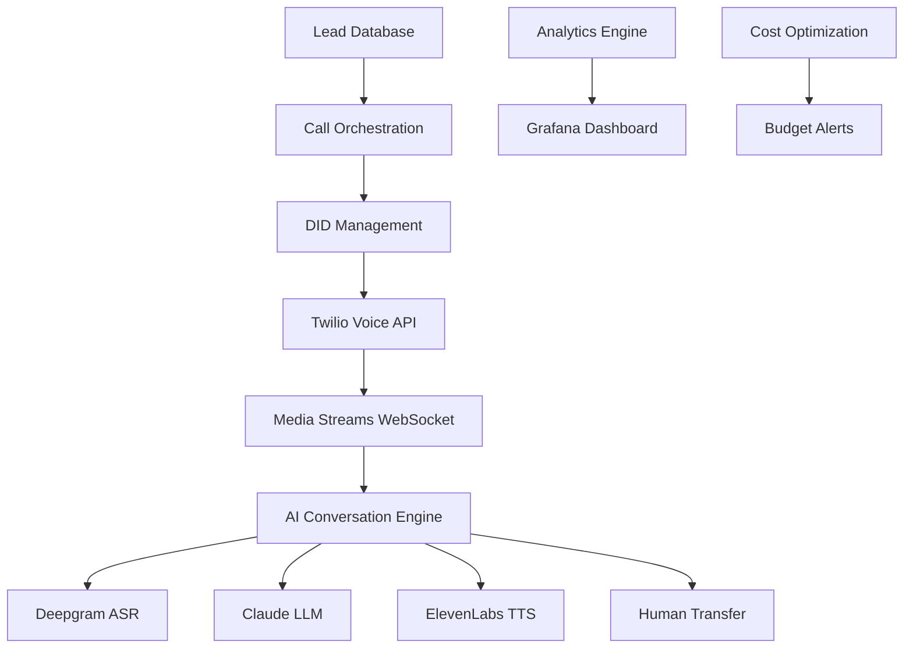

# 🤖📞 AI Voice Dialer

An enterprise-grade AI-powered outbound voice dialer with real-time conversation capabilities, intelligent DID management, and advanced analytics.

[](https://www.python.org/downloads/)
[](https://fastapi.tiangolo.com/)
[](https://www.docker.com/)
[](LICENSE)

## 🚀 Features

### Core AI Voice Capabilities
- **🎯 Real-time AI Conversations** using Claude 3.5 Haiku, Deepgram ASR, and ElevenLabs TTS
- **📞 Intelligent Call Orchestration** with priority queuing and smart routing
- **🔄 Seamless Human Transfers** when AI detects buying signals or explicit requests
- **📊 Live Audio Streaming** via Twilio Media Streams and WebSocket connections

### Advanced Optimization
- **📱 DID Reputation Management** with automated health scoring and rotation
- **💰 Real-time Cost Optimization** with budget protection and auto-pause
- **📈 Predictive Analytics** with conversion forecasting and A/B testing
- **🎖️ Multi-dimensional Quality Scoring** (audio, network, conversation, AI performance)

### Enterprise Features
- **⚖️ TCPA Compliance** with DNC scrubbing and safe calling hours
- **🔒 Security & Privacy** with encrypted data and webhook validation
- **📊 Grafana Dashboards** with real-time monitoring and alerting
- **🐳 Production Ready** with Docker, AWS Fargate, and horizontal scaling

## 🏗️ Architecture



## 🛠️ Tech Stack

| Component | Technology | Purpose |
|-----------|------------|---------|
| **Backend** | FastAPI + Python 3.12 | Async API framework |
| **Database** | PostgreSQL + Redis | Data storage + caching |
| **Voice Platform** | Twilio Programmable Voice | Call infrastructure |
| **AI Services** | Claude + Deepgram + ElevenLabs | Conversation AI |
| **Real-time** | WebSocket + Media Streams | Live audio processing |
| **Monitoring** | Prometheus + Grafana | Observability |
| **Deployment** | Docker + AWS Fargate | Container orchestration |

## 🚀 Quick Start

### Prerequisites
- Python 3.12+
- Docker & Docker Compose
- PostgreSQL 14+
- Redis 6+

### 1. Clone Repository
```bash
git clone https://github.com/yourusername/ai-voice-dialer.git
cd ai-voice-dialer
```

### 2. Environment Setup
```bash
# Copy environment template
cp env.example .env

# Edit with your API keys
nano .env
```

### 3. Required API Keys
```env
# Twilio (get from console.twilio.com)
TWILIO_ACCOUNT_SID=ACxxxxxxxxxxxxx
TWILIO_AUTH_TOKEN=your_auth_token

# AI Services
ANTHROPIC_API_KEY=sk-ant-xxxxxxxxxxxxx     # console.anthropic.com
DEEPGRAM_API_KEY=your_deepgram_key         # console.deepgram.com  
ELEVENLABS_API_KEY=your_elevenlabs_key     # elevenlabs.io
```

### 4. Start Services
```bash
# Start with Docker (recommended)
docker-compose up --build

# Or run locally
pip install -r requirements.txt
uvicorn app.main:app --reload
```

### 5. Test Your Setup
```bash
# Run comprehensive tests
python test_ai_system.py

# Check health
curl http://localhost:8000/health
```

## 📞 Making Your First AI Call

### 1. Create Campaign
```bash
curl -X POST http://localhost:8000/campaigns \
  -H "Content-Type: application/json" \
  -d '{
    "name": "My First AI Campaign",
    "script_template": "Hi, this is Sarah. How are you today?",
    "max_concurrent_calls": 5
  }'
```

### 2. Initialize Phone Numbers
```bash
curl -X POST http://localhost:8000/did/initialize \
  -H "Content-Type: application/json" \
  -d '{
    "campaign_id": "1",
    "area_codes": ["212", "213"],
    "count_per_area": 3
  }'
```

### 3. Upload Leads
```bash
curl -X POST http://localhost:8000/campaigns/1/leads \
  -H "Content-Type: application/json" \
  -d '[{
    "first_name": "John",
    "last_name": "Doe", 
    "phone": "+1234567890"
  }]'
```

### 4. Start AI Calling
```bash
# Start campaign
curl -X POST http://localhost:8000/campaigns/1/start

# Initiate call
curl -X POST http://localhost:8000/calls/initiate \
  -d '{"campaign_id": "1", "lead_id": "1"}'
```

## 📊 API Documentation

Once running, visit:
- **Interactive API Docs**: http://localhost:8000/docs
- **ReDoc Documentation**: http://localhost:8000/redoc
- **Health Check**: http://localhost:8000/health

### Key Endpoints

| Endpoint | Method | Description |
|----------|--------|-------------|
| `/campaigns` | POST | Create new campaign |
| `/calls/initiate` | POST | Start AI voice call |
| `/calls/transfer` | POST | Transfer to human agent |
| `/did/initialize` | POST | Setup phone numbers |
| `/analytics/dashboard` | GET | Real-time metrics |
| `/ws/media-stream/{id}` | WebSocket | Live audio streaming |

## 🏢 Project Structure

```
ai-voice-dialer/
├── app/
│   ├── __init__.py
│   ├── main.py                    # FastAPI application
│   ├── config.py                  # Configuration settings
│   ├── database.py                # Database connection
│   ├── models.py                  # SQLAlchemy models
│   └── services/                  # Business logic
│       ├── ai_conversation.py     # AI conversation engine
│       ├── twilio_integration.py  # Twilio voice integration
│       ├── media_stream_handler.py # WebSocket audio streaming
│       ├── call_orchestration.py  # Call management
│       ├── did_management.py      # Phone number management
│       ├── dnc_scrubbing.py       # DNC compliance
│       ├── analytics_engine.py    # Real-time analytics
│       ├── quality_scoring.py     # Call quality assessment
│       └── cost_optimization.py   # Budget management
├── requirements.txt               # Python dependencies
├── docker-compose.yml            # Docker services
├── Dockerfile                    # Container definition
├── env.example                   # Environment template
├── test_ai_system.py            # Comprehensive tests
├── DEPLOYMENT_GUIDE.md          # Deployment instructions
└── README.md                    # This file
```

## 🔧 Development Setup

### Local Development
```bash
# Create virtual environment
python -m venv venv
source venv/bin/activate

# Install development dependencies
pip install -r requirements.txt
pip install -e .

# Start database services
docker-compose up -d postgres redis

# Run with auto-reload
uvicorn app.main:app --reload --host 0.0.0.0 --port 8000
```

### Testing
```bash
# Run all tests
pytest

# Run AI system tests
python test_ai_system.py

# Test specific service
pytest tests/test_ai_conversation.py -v
```

### Code Quality
```bash
# Format code
black app/

# Lint code  
flake8 app/

# Type checking
mypy app/
```

## 🚀 Deployment

### Docker Deployment
```bash
# Build and deploy
docker-compose -f docker-compose.prod.yml up --build -d

# Scale services
docker-compose -f docker-compose.prod.yml up --scale app=3
```

### AWS Fargate
```bash
# Build and push to ECR
aws ecr get-login-password --region us-east-1 | docker login --username AWS --password-stdin <account>.dkr.ecr.us-east-1.amazonaws.com
docker build -t aidialer .
docker tag aidialer:latest <account>.dkr.ecr.us-east-1.amazonaws.com/aidialer:latest
docker push <account>.dkr.ecr.us-east-1.amazonaws.com/aidialer:latest

# Deploy to ECS
aws ecs update-service --cluster aidialer --service aidialer-service --force-new-deployment
```

See [DEPLOYMENT_GUIDE.md](DEPLOYMENT_GUIDE.md) for detailed production setup.

## 📊 Monitoring & Analytics

### Grafana Dashboards
- **Real-time Call Metrics**: Answer rates, transfer rates, cost per call
- **AI Performance**: Response times, conversation quality, success rates  
- **DID Health**: Reputation scores, carrier filtering, spam complaints
- **System Health**: CPU, memory, queue sizes, error rates

### Key Metrics
- **Answer Rate**: >18% target
- **Transfer Rate**: >9% target  
- **AI Response Time**: <800ms target
- **Cost per Transfer**: <$0.14 target

## 🤝 Contributing

We welcome contributions! Please follow these steps:

### 1. Setup Development Environment
```bash
git clone https://github.com/yourusername/ai-voice-dialer.git
cd ai-voice-dialer
python -m venv venv
source venv/bin/activate
pip install -r requirements.txt
```

### 2. Create Feature Branch
```bash
git checkout -b feature/your-feature-name
```

### 3. Make Changes
- Follow existing code style (black, flake8)
- Add tests for new functionality
- Update documentation as needed

### 4. Test Your Changes
```bash
# Run tests
python test_ai_system.py
pytest

# Check code quality
black app/ && flake8 app/ && mypy app/
```

### 5. Submit Pull Request
- Provide clear description of changes
- Include test results
- Reference any related issues

## 📋 Roadmap

### Phase 1: Core AI Voice ✅
- [x] Real-time AI conversations
- [x] Twilio Media Streams integration
- [x] Claude + Deepgram + ElevenLabs
- [x] Call orchestration and transfers

### Phase 2: Advanced Features ✅  
- [x] DID reputation management
- [x] Cost optimization engine
- [x] Quality scoring system
- [x] Analytics and dashboards

### Phase 3: Enterprise Features 🚧
- [ ] Multi-tenant architecture
- [ ] Advanced ML models
- [ ] Custom voice cloning
- [ ] International calling

### Phase 4: Scale & Optimization 📋
- [ ] Kubernetes deployment
- [ ] Auto-scaling ML inference
- [ ] Edge computing for latency
- [ ] Advanced fraud detection

## 🔒 Security & Compliance

- **TCPA Compliance**: Automated DNC scrubbing, safe calling hours
- **Data Encryption**: All sensitive data encrypted at rest and in transit
- **API Security**: Rate limiting, webhook validation, secure headers
- **PCI Compliance**: No credit card data stored or transmitted
- **SOC 2 Ready**: Audit logging, access controls, monitoring

## 📝 License

This project is licensed under the MIT License - see the [LICENSE](LICENSE) file for details.

## 🆘 Support

### Documentation
- [Deployment Guide](DEPLOYMENT_GUIDE.md) - Production setup instructions
- [API Documentation](http://localhost:8000/docs) - Interactive API docs
- [Test Reports](test_ai_system.py) - System validation

### Community
- **Issues**: [GitHub Issues](https://github.com/yourusername/ai-voice-dialer/issues)
- **Discussions**: [GitHub Discussions](https://github.com/yourusername/ai-voice-dialer/discussions)
- **Discord**: [Join our Discord](https://discord.gg/your-invite)

### Professional Support
For enterprise support, custom implementations, or consulting:
- 📧 Email: support@yourcompany.com
- 📅 Book a call: [calendly.com/your-link](https://calendly.com/your-link)

---

<div align="center">

**Built with ❤️ for the future of AI voice technology**

[⭐ Star this repo](https://github.com/yourusername/ai-voice-dialer) | [🐛 Report Bug](https://github.com/yourusername/ai-voice-dialer/issues) | [💡 Request Feature](https://github.com/yourusername/ai-voice-dialer/issues)

</div> 